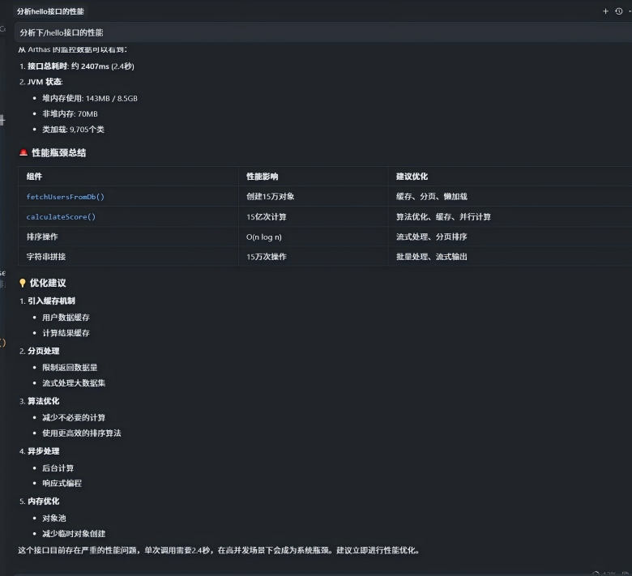

# Arthas MCP Server

[](README.md) [](README.zh-CN.md)

Java 智能诊断 MCP 服务器

## 项目概述

Arthas MCP Server 是基于 [Model Context Protocol (MCP)](https://modelcontextprotocol.io) 的智能化 Java 应用诊断工具，专为 LLM 集成设计。它提供了与 [Arthas](https://arthas.aliyun.com/) 的无缝集成，让 AI 助手能够智能地诊断和分析 Java 应用程序。

## 使用示例

### 示例：通过 AI 助手进行性能分析



上图展示了如何通过 AI 助手（如 Claude）以自然语言交互的方式，智能诊断 Java 应用性能问题。只需描述你的问题，AI 助手会自动：

- 连接到 Arthas 服务器
- 执行适当的诊断命令
- 分析性能指标
- 提供可操作的洞察和建议

这消除了手动记忆 Arthas 命令语法和参数的需要。

## 核心特性

- 🔍 **智能诊断**: 通过 LLM 友好的接口提供 Java 应用性能分析
- 🚀 **实时监控**: JVM 运行时状态、线程、内存使用情况监控
- 📊 **性能分析**: CPU 使用率、方法调用链、性能瓶颈识别
- 🔧 **动态修改**: 支持运行时类和方法的动态修改
- 🤖 **LLM 集成**: 专为 AI 助手优化的自然语言交互界面

## 快速开始

### 环境要求

- Python 3.13+
- 运行中的 Java 应用程序
- Arthas 3.6.7+

### 安装

```bash
# 使用 uv 安装依赖
uv sync

```

### 启动服务器

```bash
# 直接运行
python main.py

```

## MCP 工具

### 连接管理
- `connect_arthas` - 连接到 Arthas WebConsole
- `get_connection_status` - 获取连接状态
- `disconnect_arthas` - 断开连接

### 诊断工具
- `get_jvm_info` - 获取 JVM 基本信息
- `get_thread_info` - 获取线程状态和性能信息
- `get_memory_info` - 获取内存使用情况
- `execute_arthas_command` - 执行自定义 Arthas 命令

### 性能分析
- `analyze_performance` - 性能瓶颈分析
- `trace_method_calls` - 方法调用链跟踪

## 配置

### 1. 添加到 Cursor，Claude Code

在 Cursor 配置文件中添加 MCP 服务器配置：

**macOS**: `~/.cursor/mcp.json`
**Windows**: `C:\Users\{用户名}\.cursor\mcp.json`

```json
{
  "mcpServers": {
    "arthas": {
      "command": "uv",
      "args": ["--directory", "F:\\path\\to\\arthas_mcp_server", "run", "python", "main.py"],
      "env": {
        "ARTHAS_URL": "http://localhost:8563"   # arthas远程http服务器地址
      }
    }
  }
}
```


### 2.  启动 Arthas，并配置Arthas远程配置ARTHAS_URL

在目标 Java 应用程序中启动 Arthas：

有多种方式：可以attach,也可以用 agent 模式，最终目标是在8563端口监听http请求（arthas命令），MCP通过这个端点获取数据


## 项目结构

```
arthas_mcp_server/
├── src/                # 
│   ├── __init__.py     # 
│   ├── models.py       # 数据模型
│   ├── server.py       # MCP 服务器
│   └── client.py       # Arthas 客户端
├── main.py             # 服务器入口
├── pyproject.toml      # 项目配置
└── README.md           # 项目说明
```

## 开发

### 开发环境设置

```bash
# 安装开发依赖
uv sync --extra dev

```


